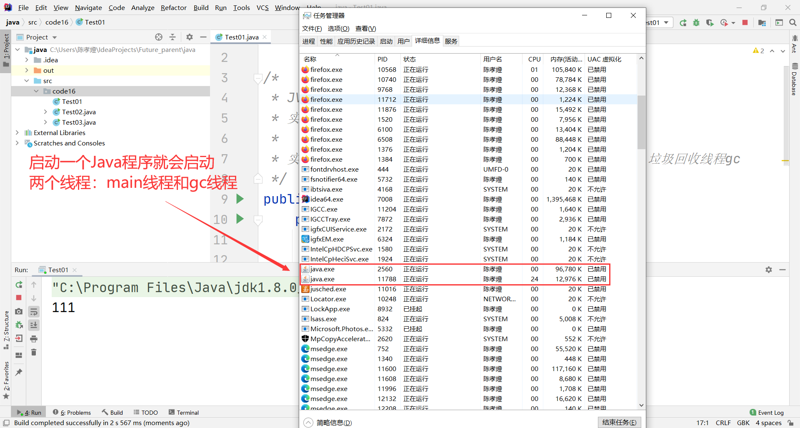
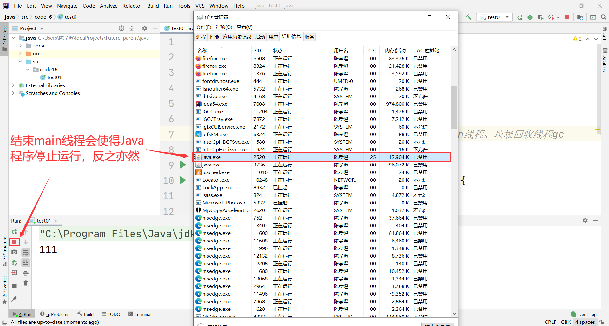
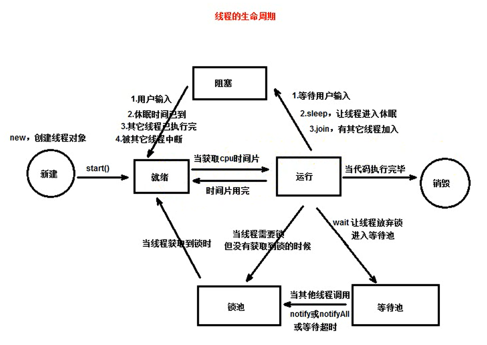

# 一. 简介

## 1. 进程

进程（process）：在操作系统中，每运行一个应用程序就对应一个进程。如打开一个浏览器、QQ、IDEA都会启动一个进程。（进程会占用内存）


多进程：在操作系统中，可以同时运行多个程序，即多个进程同时运行。如浏览器、QQ、IDEA可以同时运行。


## 2. 线程

线程（thread）：是进程内部的一个执行单元，用来执行应用程序中的一个功能（一个应用程序有很多个功能）。如打开QQ后，可以进行QQ聊天、下载传输文件、QQ视频、QQ语音，每个功能都对应一个或多个线程。


多线程：一个进程可以包含多个线程（即在一个应用程序中可以同时执行多个功能）。例如迅雷中同时执行多个下载任务就是多线程。


## 3. 线程和进程的关系

- 一个进程中可以包含多个线程，且至少要有一个线程。

- 一个线程必须属于某个进程，进程是线程的容器。

- 一个进程中的多个线程共享该进程的所有资源（如进程所占内存等）。


## 4. CPU时间片

对于单核CPU（现在的CPU大多都是多核的），在某个时间点（瞬间）只能处理一个程序（进程），即在某个时间点只能允许一个进程运行。


CPU分配给各个进程的运行的时间（时间很短），称为时间片，即该进程允许运行的时间。如在0.01S内执行了一下QQ，又在下一个0.01S执行了一下迅雷……


CPU对进程的处理：

- 从表面上看各个程序是同时运行的，实际上CPU在同一时间只能运行一个程序。


- CPU在不同的程序间切换，轮流执行每个程序，切换和执行速度很快，感觉上像是同时在运行。


- 对于多核CPU，在一个时间点可以有多个进程运行。


CPU对线程的处理：

与上面"CPU对进程的处理"相同。

# 二. 创建线程

## 1. 主线程

**代码：**

**javase/src/code16/Test01.java：**

```java
/*
 * JVM启动时会创建一个主线程，用来执行main方法
 * 实现多线程，需要在主线程中创建新的线程
 *
 * 实际上，Java程序在运行时至少会启动两个线程：main线程、垃圾回收线程gc
 */
public class Test01 {
    public static void main(String[] args) {
        System.out.println(111);
        while (true) {
        }
    }
}
```


**java执行结果：**






## 2. 创建线程的两种方式

### 2.1. 继承Thread类

#### 2.1.1. 步骤

1. 定义一个类，继承自`Thread`类，重写`run()`方法：

   ```java
   class MyThread extends Thread {
       // 在run()方法中编写线程要执行的代码
       @Override
       public void run() {
           for (int i = 1; i <= 10000; i++) {
               System.out.println("-------------" + i);
           }
       }
   }
   ```

2. 创建该类的实例，即创建一个线程：

   ```java
   // 创建线程  
   MyThread mt = new MyThread();
   ```

3. 调用线程的`start()`方法，启动线程：

   ```java
   // 启动线程，会自动调用run()方法
   // 不能直接调用run()方法，否则就变成直接调用了一个普通对象的方法，而不是启动线程
   mt.start();
   ```

#### 2.2.2. 应用

**代码：**

**javase/src/code16/Test01.java：**

```java
package code16;

/*
 * JVM启动时会创建一个主线程，用来执行main方法
 * 实现多线程，需要在主线程中创建新的线程
 *
 * 实际上，Java程序在运行时至少会启动两个进程：main线程、垃圾回收线程gc
 */
public class Test01 {
    public static void main(String[] args) {
        // 创建线程
        MyThread t1 = new MyThread("线程1"); // 自定义线程的默认名称：Thread - 编号，编号从0开始，按创建线程的先后顺序依次递增1
        // 启动线程，会自动调用run()方法
        t1.start(); // 线程并不一定立即执行，要获取到CPU时间片才会执行

        // MyThread t2 = new MyThread("线程2");
        MyThread t2 = new MyThread();
        t2.setName("线程2");
        t2.start();

        // Thread t = Thread.currentThread(); // 获取当前的线程对象（这里就是main线程）

        Thread t = Thread.currentThread();
        t.setName("主线程");
        for (int i = 1; i <= 10000; i++) {
            System.out.println(t.getName() + "-------------" + i); // 主线程的默认名称就是main
        }
    }
}

class MyThread extends Thread {

    public MyThread() {
    }

    public MyThread(String name) {
        super(name); // 调用父类的构造方法来指定线程的名字
    }

    // 在run()方法中编写线程要执行的代码
    @Override
    public void run() {
        for (int i = 1; i <= 10000; i++) {
            System.out.println(getName() + "-------------" + i); // 调用 getName() 获取线程名
        }
    }
}
```


**java执行结果：**


### 2.2. 实现Runnable接口（推荐）

#### 2.2.1. 步骤

1. 定义一个类，实现`Runnable`接口，实现`run()`方法：

   ```java
   class MyRunnable implements Runnable {
   
       @Override
       public void run() {
           for (int i = 1; i <= 10000; i++) {
               System.out.println(Thread.currentThread().getName()
                       + "----------" + i);
           }
       }
   }
   ```

2. 创建实现类的实例：

   ```java
   // 创建实现类的一个实例
   MyRunnable mr = new MyRunnable();
   ```

3. 创建Thread类的一个实例，将Runnable实现类的实例传入：

   ```java
   // 创建线程
   Thread t1 = new Thread(mr); // 将Runnable实现类的实例传入
   ```

4. 调用start()方法，启动线程：

   ```java
   // 启动线程
   t1.start();
   ```

#### 2.2.2. 应用

**代码：**

**javase/src/code16/Test02.java：**

```java
package code16;

public class Test02 {
    public static void main(String[] args) {
        // 创建实现类的一个实例
        MyRunnable mr = new MyRunnable();

        // 创建线程
        Thread t1 = new Thread(mr); // 将Runnable实现类的实例传入
        // 启动线程
        t1.start();

        Thread t2 = new Thread(mr);
        // Thread t2 = new Thread(mr, "线程2");
        // t2.setName("线程2");
        t2.start();

        for (int i = 1; i <= 10000; i++) {
            System.out.println(Thread.currentThread().getName() + "----------" + i);
        }
    }
}

class MyRunnable implements Runnable {

    @Override
    public void run() {
        for (int i = 1; i <= 10000; i++) {
            System.out.println(Thread.currentThread().getName()
                    + "----------" + i);
        }
    }
}
```


**java执行结果：**


## 3. 两种创建线程的方式的对比

继承Thread类：

- 线程执行的代码放在Thread类的子类的run方法中。

- Thread类的子类无法再继承其它类。


实现Runnable接口（推荐）：

- 线程执行的代码放在Runnable接口的实现类的run方法中。

- Runnable接口的实现类可以继承其它类，避免单继承的局限性。

- 适合多个相同程序代码的线程去处理同一个资源。
- 代码和线程独立，实现了二者的解耦合。
- 增强程序的健壮性。


**代码：**

**javase/src/code16/Test03.java：**

```java
package code16;

/*
 * 模拟出票
 */
public class Test03 {
    public static void main(String[] args) {
        // MyThread2 t1 = new MyThread2("窗口1");
        // MyThread2 t2 = new MyThread2("窗口2");
        // t1.start();
        // t2.start();

        MyTicket myTicket = new MyTicket();
        Thread t1 = new Thread(myTicket, "窗口1");
        Thread t2 = new Thread(myTicket, "窗口2");
        t1.start();
        t2.start();
    }
}

class MyThread2 extends Thread {
    // int num = 100; // 一共100张车票
    // 该类的不同对象需要共享num变量，否则每个对象都会卖100张车票，即一共卖出200张及其以上的车票（与实际不符）
    // num变量需要被static修饰
    static int num = 100; // 类加载时就初始化，线程的生命周期太长，不合适

    public MyThread2(String name) {
        super(name);
    }

    @Override
    public void run() {
        while (num > 0) {
            System.out.println(getName() + "-------" + num--);
        }
    }
}

class MyTicket implements Runnable {
    int num = 100; // 100张车票，这里由于创建线程对象时是传入的同一个MyTicket，因此num无需被static修饰
    // 通过实现Runnable接口去创建线程，适合多个相同程序代码的线程去处理同一个资源，如这里的num无需被static修饰

    @Override
    public void run() {
        while (num > 0) {
            System.out.println(Thread.currentThread().getName() + "-------" + num--);
        }
    }
}
```


**java执行结果：**


现象：输出结果可能未按照顺序显示。

原因：虽然执行了出票的操作，但可能暂时未显示打印结果，而此时另一个线程却先打印出来了。

# 三. 线程的生命周期

## 1. 生命周期




线程的5种状态：新建、就绪、运行、阻塞、销毁。

## 2. 线程优先级

线程优先级代表线程获取CPU时间片的概率，优先级越高，获取CPU时间片的概率越大（即执行该线程机会越大，但并不一定就始终优先执行该线程）。


通过`setPriority`和`getPriority`方法设置和获取线程优先级。


**代码：**

**javase/src/code16/Test04.java：**

```java
package code16;

/*
 * 线程优先级
 * 范围为[1,10]，值为整数，越大优先级越高
 * 优先级越高，执行该线程的机会越大，但并不一定就始终优先执行该线程
 */
public class Test04 {
    public static void main(String[] args) {
        // System.out.println("线程最大优先级" + Thread.MAX_PRIORITY); // 10
        // System.out.println("最小优先级" + Thread.MIN_PRIORITY); // 1
        // System.out.println("普通优先级" + Thread.NORM_PRIORITY); // 5
        // System.out.println("主线程默认优先级" + Thread.currentThread().getPriority()); // 5

        for (int i = 1; i <= 20; i++) {
            MyThread3 t1 = new MyThread3();
            MyThread3 t2 = new MyThread3();
            t1.setPriority(10);
            t2.setPriority(1);
            t1.start();
            t2.start();
        }
    }
}

class MyThread3 extends Thread {

    @Override
    public void run() {
        long start = System.currentTimeMillis();

        String str = "";
        for (int i = 1; i <= 10000; i++) {
            str += i;
        }

        long end = System.currentTimeMillis();
        System.out.println(getPriority() + "--------" + (end - start) + "ms");
    }
}
```


**java执行结果：**


可以看出线程10"普遍"在线程1之前执行完，且线程10的执行时间"普遍"低于线程1。

## 3. 生命周期相关方法

| 方法名    | 作用                                                                                  | 说明                       |
|-----------|---------------------------------------------------------------------------------------|----------------------------|
| start     | 启动线程，线程进入就绪状态（可运行状态）                                              | 实例方法                   |
| sleep     | 休眠线程，线程从执行状态进入阻塞状态                                                  | 静态方法，并且需要处理异常 |
| yield     | 暂停执行线程（放弃CPU时间片），线程从执行状态进入就绪状态（之后小概率仍会执行该线程） | 静态方法                   |
| join      | 暂停执行线程，等待另一个线程执行完毕后再执行，线程从执行状态进入阻塞状态              | 实例方法，并且需要处理异常 |
| interrupt | 中断线程的休眠或等待状态                                                              |                            |


**代码：**

**javase/src/code16/Test05.java：**

```java
package code16;

public class Test05 {
    public static void main(String[] args) {
        Thread t = new Thread(() -> {

            for (int i = 1; i <= 50; i++) {
                if (i == 8) {
                    try {
                        Thread.sleep(5000); // 休眠5s，单位为ms
                    } catch (InterruptedException e) {
                        System.out.println(Thread.currentThread().getName() + "的休眠被打断了");
                    }
                    // Thread.yield(); // 暂停执行线程，放弃线程对CPU的控制权，进入就绪状态（之后小概率仍会执行该线程）
                }
                System.out.println(Thread.currentThread().getName() + "------" + i);
            }
        }, "t");
        t.start();

        try {
            Thread.sleep(2000);
        } catch (InterruptedException e) {
            e.printStackTrace();
        }

        for (int i = 1; i <= 50; i++) {
            // if (i == 3) {
            //     try {
            //         t.join(); // t线程加入，主线程等待t线程执行完毕后再继续执行
            //     } catch (InterruptedException e) {
            //         e.printStackTrace();
            //     }
            // }
            System.out.println(Thread.currentThread().getName() + "------" + i);
        }

        t.interrupt(); // 中断t线程的休眠状态
    }
}
```


**java执行结果：**


main线程执行至最后一条语句，中断t线程的休眠，因此t线程会在main线程执行完后紧接着执行，而不是继续处于休眠状态。

# 四. 线程安全问题

## 1. 简介

多个线程同时访问共享数据时可能会出现问题，称为线程安全问题。

- 当多线程访问共享数据时，由于CPU的切换，导致一个线程只执行了关键代码的一部分，还没执行完剩余的部分。
- 此时另一个线程参与进来，导致共享数据发生异常（数据脏读）。


解决：线程同步机制"`synchronized` + 锁"。

- 被synchronized包围的代码块，称为同步代码块。
- 被synchronized修饰的方法，称为同步方法。
- 锁：也称为对象锁，每个对象都自带一个锁（标识），且不同对象的锁是不一样的。


线程同步机制的执行过程：

- 当线程执行同步代码块或同步方法时，必须获取特定对象的锁。
- 一旦对象的锁被获取，则该对象就不再拥有锁，线程执行完同步代码块或同步方法时才会释放对象的锁。
- 如果线程无法获取特定对象上的锁，则线程会进入"该对象的锁池"进行等待，直到锁被归还给对象，此时需要该锁的线程会进行竞争。


线程同步的优缺点：

- 优点：解决了线程安全的问题，使代码块在某一时间只能被一个线程访问。
- 缺点：需要进行锁的判断，消耗资源，效率变低。

## 2. 应用

**代码：**

**javase/src/code16/test06/Ticket.java：**

```java
package code16.test06;

public class Ticket implements Runnable {

    // private int num = 100; // 共100张票，共享此数据
    private static int num = 100;

    // Object obj = new Object();

    @Override
    public void run() {
        // 只需要将关键代码放到synchronized块中，不要将run方法中的所有代码都添加进去，否则就相当于单线程

        System.out.println(Thread.currentThread().getName() + "正在售票！");

        while (true) {
            // 同步代码块，保护共享数据的安全
            // synchronized (this) { // 使用本类的当前对象作为锁
            //     // synchronized (obj) { // 锁可以是任意对象
            //     // synchronized (new Object()) { // 无法解决数据脏读的问题，多个线程必须使用同一把锁。这里的每个线程执行同步代码块时，获取到的锁都不一样（不同对象的锁不一样），从而立即执行同步代码块，而不会进入对象的锁池等待，相当于未使用线程同步机制
            //     if (num > 0) {
            //         try {
            //             Thread.sleep(10);
            //         } catch (InterruptedException e) {
            //             e.printStackTrace();
            //         }
            //         System.out.println(Thread.currentThread().getName() + "----售出车票：" + num--); // 若未使用线程同步机制，num可能发生数据脏读
            //     }
            // }
            sellTicket();
        }
    }

    // 同步方法，使用的是this锁
    // public synchronized void sellTicket() {
    //     if (num > 0) {
    //         try {
    //             Thread.sleep(10);
    //         } catch (InterruptedException e) {
    //             e.printStackTrace();
    //         }
    //         System.out.println(Thread.currentThread().getName() + "----售出：" + num--);
    //     }
    // }

    // 同步静态方法，使用的是当前类的Class对象的锁，即Ticket.class（反射会讲）的锁
    public static synchronized void sellTicket() {
        if (num > 0) {
            try {
                Thread.sleep(10);
            } catch (InterruptedException e) {
                e.printStackTrace();
            }
            System.out.println(Thread.currentThread().getName() + "----售出车票：" + num--);
        }
    }
}
```


**javase/src/code16/test06/Test.java：**

```java
package code16.test06;

public class Test {
    public static void main(String[] args) {
        Ticket ticket = new Ticket();

        Thread t1 = new Thread(ticket, "窗口1");
        Thread t2 = new Thread(ticket, "窗口2");
        Thread t3 = new Thread(ticket, "窗口3");
        t1.start();
        t2.start();
        t3.start();
    }
}
```


**java执行结果：**

自行测试。

## 3. 练习：解决懒汉式单例模式的线程安全问题

懒汉式单例模式：一种代码[设计模式](18. Design Pattern.md)。


**代码：**

**javase/src/code16/test06/Singleton.java：**

```java
package code16.test06;

public class Singleton {

    private static Singleton instance;

    public Singleton() {
        System.out.println("Singleton.Singleton");
    }

    public synchronized static Singleton getInstance() {
        if (instance == null) {
            try {
                Thread.sleep(10);
            } catch (InterruptedException e) {
                e.printStackTrace();
            }
            instance = new Singleton();
        }
        return instance;
    }
}
```


**javase/src/code16/test06/Test.java：**

```java
package code16.test06;

public class Test {
    public static void main(String[] args) {
        // Ticket ticket = new Ticket();
        //
        // Thread t1 = new Thread(ticket, "窗口1");
        // Thread t2 = new Thread(ticket, "窗口2");
        // Thread t3 = new Thread(ticket, "窗口3");
        // t1.start();
        // t2.start();
        // t3.start();

        new Thread(() -> System.out.println(Singleton.getInstance())).start();

        new Thread(() -> System.out.println(Singleton.getInstance())).start();
    }
}
```


**java执行结果：**


# 五. 线程间的通信

## 1. 锁池和等待池

每个对象都自带锁池和等待池。


锁池：

- 当线程执行synchronized块时如果无法获取特定对象上的锁，此时会进入对象的锁池。
- 当锁被归还给该对象时，锁池中的多个线程会竞争获取该对象的锁。
- 获取对象锁的线程将执行synchronized块，执行完毕后会释放锁。


等待池：

- 当线程获取对象的锁后，可以调用该对象的`wait()`方法放弃锁，此时会进入该对象的等待池。
- 当其它线程调用该对象的`notify()`或`notifyAll()`方法时，等待池中的线程会被唤醒，进入该对象的锁池。
- 当线程获取到对象的锁后，将从它上次调用wait()方法的位置开始继续运行。

## 2. 相关方法

| 方法名    | 作用                                       | 说明                                       |
| --------- | ------------------------------------------ | ------------------------------------------ |
| wait      | 使线程放弃对象锁，线程进入等待池           | 可以设置等待超时时间，超时后线程会自动唤醒 |
| notify    | 随机唤醒等待池中的一个线程，该线程进入锁池 | 唤醒的是特定对象的等待池中的线程           |
| notifyAll | 唤醒等待池中的所有线程                     |                                            |


注：

- 这三个方法都只能在synchronized块中使用，即只有获取了锁的线程才能调用。
- 等待和唤醒必须使用的是同一个对象，否则无法唤醒等待池中的线程。


**代码：**

**javase/src/code16/test07/Wait.java：**

```java
package code16.test07;

public class Wait extends Thread {

    private Object obj;

    public Wait() {
    }

    public Wait(Object obj) {
        this.obj = obj;
    }

    @Override
    public void run() {
        System.out.println(111);

        synchronized (obj) {
            try {
                System.out.println(getName() + "释放锁，即将进入等待池……");
                // this.wait(2000); // 设置等待的超时时间
                obj.wait(); // 若不设置等待超时时间，则会一直等待，直到被唤醒或中断
            } catch (InterruptedException e) {
                System.out.println(getName() + "被中断……");
            }
        }

        System.out.println(222);
    }
}
```


**javase/src/code16/test07/Notify.java：**

```java
package code16.test07;

public class Notify extends Thread {

    private Object obj;

    public Notify() {
    }

    public Notify(Object obj) {
        this.obj = obj;
    }

    @Override
    public void run() {

        synchronized (obj) {
            // obj.notifyAll();
            obj.notify();
            System.out.println(getName() + "已唤醒等待池中的线程……");
        }
    }
}
```


**javase/src/code16/test07/Test.java：**

```java
package code16.test07;

public class Test {

    public static void main(String[] args) {
        Object obj = new Object(); // 等待和唤醒所使用的同一个对象

        Wait w = new Wait(obj);
        w.start();

        try {
            Thread.sleep(3000);
        } catch (InterruptedException e) {
            e.printStackTrace();
        }

        // w.interrupt(); // 直接中断线程的等待，一般不会这样做

        Notify n = new Notify(obj);
        n.start(); // 一般都会让其它线程去唤醒等待池中的线程
    }
}
```


**java执行结果：**


# 六. 生产者和消费者

## 1. 简介

"生产者-消费者"问题是多线程同步的一个经典问题，即并发协作的问题。


该问题包含两种线程：生产者线程、消费者线程。


生产者线程：

- 生产商品放入缓冲区。
- 当缓冲区满时，生产者不可再生产商品。


消费者线程：

- 从缓冲区取出商品。
- 当缓冲区为空时，消费者不可再取出商品。


注：生产者和消费者使用的是同一个缓冲区。


## 2. 实现

**代码：**

**javase/src/code16/test08/ProductPool.java：**

```java
package code16.test08;

/*
 * 商品池
 */
public class ProductPool {

    private int num; // 商品数量
    private static final int MAX_COUNT = 20; // 最大数量

    // 放入商品
    public void put() {
        num++;
    }

    // 取出商品
    public void get() {
        num--;
    }

    // 获取商品数量
    public int getNum() {
        return num;
    }

    // 是否为空
    public boolean isEmpty() {
        return this.num == 0;
    }

    // 是否已满
    public boolean isFull() {
        return this.num == MAX_COUNT;
    }
}
```


**javase/src/code16/test08/Producer.java：**

```java
package code16.test08;

public class Producer extends Thread {

    private String name; // 生产者名称
    private ProductPool pool; // 商品池

    public Producer() {
    }

    public Producer(String name, ProductPool pool) {
        this.name = name;
        this.pool = pool;
    }

    @Override
    public void run() {
        synchronized (pool) {
            while (true) {
                if (pool.isFull()) {
                    try {
                        pool.wait();
                    } catch (InterruptedException e) {
                        e.printStackTrace();
                    }
                } else {
                    pool.put();
                    System.out.println(name + "生产了一个商品，现在的商品数量：" + pool.getNum());
                    pool.notifyAll();
                    /*
                     * Producer和Consumer类必须都要调用notifyAll()方法
                     * 否则一方达到临界条件时，开始等待；另一方达到临界条件时，也开始等待
                     * 二者一直处于等待池，占用着系统资源，没有其它线程唤醒或中断它们
                     * 即线程死锁
                     */
                }

                try {
                    Thread.sleep(3000);
                } catch (InterruptedException e) {
                    e.printStackTrace();
                }
            }
        }
    }
}
```


**javase/src/code16/test08/Consumer.java：**

```java
package code16.test08;

/*
 * 消费者
 */
public class Consumer extends Thread {

    private String name; // 消费者名称
    private ProductPool pool; // 商品名称

    public Consumer() {
    }

    public Consumer(String name, ProductPool pool) {
        this.name = name;
        this.pool = pool;
    }

    @Override
    public void run() {
        while (true) {
            synchronized (pool) {
                if (pool.isEmpty()) {
                    try {
                        pool.wait();
                    } catch (InterruptedException e) {
                        e.printStackTrace();
                    }
                } else {
                    pool.get();
                    System.out.println(name + "消费了一个商品，现在的商品数量是：" + pool.getNum());
                    pool.notifyAll();
                    /*
                     * Producer和Consumer类必须都要调用notifyAll()方法
                     * 否则一方达到临界条件时，开始等待；另一方达到临界条件时，也开始等待
                     * 二者一直处于等待池，占用着系统资源，没有其它线程唤醒或中断它们
                     * 即线程死锁
                     */
                }
            }

            try {
                Thread.sleep(2000);
            } catch (InterruptedException e) {
                e.printStackTrace();
            }
        }
    }
}
```


**javase/src/code16/test08/Test.java：**

```java
package code16.test08;

public class Test {
    public static void main(String[] args) {

        ProductPool pool = new ProductPool();

        Producer p1 = new Producer("p1", pool);
        Producer p2 = new Producer("p2", pool);
        Producer p3 = new Producer("p3", pool);

        Consumer c1 = new Consumer("c1", pool);
        Consumer c2 = new Consumer("c2", pool);

        p1.start();
        p2.start();
        p3.start();

        c1.start();
        c2.start();
    }
}
```


**java执行结果：**

自行测试。

## 3. 线程死锁

在"生产者-消费者"问题中，如果Producer或Consumer没用调用对象的notifyAll()方法，一方达到临界条件时，开始等待，另一方达到临界条件时，也会开始等待，二者一直处于等待池，占用着系统资源，没有其它线程唤醒或中断它们，就会造成线程死锁（需要避免）。

## 4. 总结

"生产者-消费者"问题的实现，实际上就是生产者线程和消费者线程相互等待的过程。

# 七. 线程单例

## 1. 简介

为每个线程提供一个实例（Java对象）：

- 同一个线程获取的是同一个实例。
- 不同线程获取的是不同的实例。


Java中提供了一个`ThreadLocal`类，直接给出了线程单例的解决方案。

- 用于管理变量，提供线程局部变量（每个线程独有的变量，不被其它线程共享）。
- 在每个线程中，都存储着某个变量的引用，即变量的本地（本线程）副本。


应用场景：数据库连接池、Session会话等。

## 2. 应用

**javase/src/code16/test09/MyThreadLocal.java：**

```java
package code16.test09;

import java.util.HashMap;
import java.util.Map;

/*
 * 线程单例
 */
public class MyThreadLocal<T> {

    private Map<Thread, T> map = new HashMap<>();

    public void set(T t) {
        map.put(Thread.currentThread(), t); // 将当前线程作为key
    }

    public T get() {
        return map.get(Thread.currentThread());
    }
}
```


**javase/src/code16/test09/User.java：**

```java
package code16.test09;

public class User {

    public User() {
        System.out.println("User.User");
    }
}
```


**javase/src/code16/test09/Test.java：**

```java
package code16.test09;

public class Test {

    // static MyThreadLocal<User> local = new MyThreadLocal<>();
    static ThreadLocal<User> local = new ThreadLocal<>();

    public static void main(String[] args) {
        local.set(new User());
        local.set(new User());
        local.set(new User());

        System.out.println(local.get());
        System.out.println(local.get());
        System.out.println(local.get() == local.get());

        new Thread(() -> {
            // local.set(new User());
            System.out.println(local.get());
        }).start();
    }
}
```


**java执行结果：**


# 八. 线程池

## 1. 简介

线程池Thread Pool，是一个容纳多个线程的容器，里面的线程可以反复使用。


好处：

- 降低资源消耗：通过重复利用已创建的线程，降低线程创建和销毁造成的资源消耗。
- 提高响应速度：当有任务时，无需等待线程创建，就能立即执行。
- 提高线程的可管理性：线程池可以对线程进行统一的分配、调优和监控。


**代码：**

**javase/src/code16/test10/Task.java：**

```java
package code16.test10;

public class Task implements Runnable {

    @Override
    public void run() {
        System.out.println(Thread.currentThread().getName());
    }
}
```


**javase/src/code16/test10/Test01.java：**

```java
package code16.test10;

import java.util.concurrent.ExecutorService;
import java.util.concurrent.Executors;

public class Test01 {
    public static void main(String[] args) {
        /*
         * 创建任务
         */
        Task task1 = new Task();
        Task task2 = new Task();
        Task task3 = new Task();

        /*
         * 创建线程
         */
        // Thread thread = new Thread(mr1, mr2, mr3); // 没有该写法，一个线程只能执行一个任务
        // Thread thread1 = new Thread(mr1);
        // Thread thread2 = new Thread(mr2);
        // Thread thread3 = new Thread(mr3);
        // // 线程不能复用，损耗资源

        // 创建只有一个线程的线程池
        ExecutorService threadPool = Executors.newSingleThreadExecutor();

        // /*
        //  * 启动线程
        //  */
        // thread.start();
        // thread1.start();
        // thread2.start();
        // thread3.start();

        /*
         * 提交任务
         */
        threadPool.execute(task1);
        threadPool.execute(task2);
        threadPool.execute(task3);
        // 线程得到复用，降低资源损耗

        // 关闭线程池
        threadPool.shutdown();
    }
}
```


**java执行结果：**


## 2. 线程池的API

线程池相关的API都在`java.util.concurrent`包中。

```java
|- Executor
    |- ExecutorService
        |- AbstractExecutorService
            |- ThreadPoolExecutor // 核心线程池
                |- ScheduledThreadPoolExecutor
        |- ScheduledExecutorService // 调度线程池
            |- ScheduledThreadPoolExecutor
```

## 3. 创建线程池

线程池的基本属性：

| 属性            | 含义             | 描述                                                         |
| --------------- | ---------------- | ------------------------------------------------------------ |
| corePoolSize    | 核心线程数       | 核心线程：只要线程池不关闭，就不会被销毁的线程               |
| maximumPoolSize | 最大线程数       | 线程池中最多允许有的线程数                                   |
| keepAliveTime   | 空闲线程存活时间 | 非核心线程（线程池中除了核心线程以外的线程）没有执行任务时，超过空闲线程存活时间，就会被清理 |
| unit            | 时间单位         | keepAliveTime的时间单位                                      |
| workQueue       | 任务队列         | 存放任务（Runnable实例）的容器，提交给线程池的任务都位于这里，线程池中的线程也都是在该容器中领取任务。常用的有LinkedBlockingQueue、ArrayBlockingQueue等 |
| threadFactory   | 线程工厂         | 指定线程的创建过程                                           |
| handler         | 任务拒绝策略     | 指定线程池拒绝提交的任务后，执行的操作                       |


核心线程池：ThreadPoolExecutor。


其它线程池：

- FixedThreadPool：固定线程数量的线程池。
- SingleThreadExecutor：只有一个线程的线程池。
- CachedThreadPool：可缓存的线程池。

这三种线程池都是由`Executors`（线程池的工具类），对ThreadPoolExecutor进行包装，从而创建的。

注：实际应用中，一般不使用这三种线程池，存在风险。


**代码：**

**javase/src/code16/test10/Test02.java：**

```java
package code16.test10;

import java.util.concurrent.*;

public class Test02 {
    public static void main(String[] args) {
        // 创建任务
        Task task1 = new Task();
        Task task2 = new Task();
        Task task3 = new Task();

        /*
         * 创建线程池
         */
        // 1. ThreadPoolExecutor
        // ThreadPoolExecutor threadPool = new ThreadPoolExecutor(
        //         10, // 核心线程数
        //         25, // 最大线程数
        //         10, // 空闲线程存活时间
        //         TimeUnit.SECONDS, // keepAliveTime的单位，这里为秒
        //         new LinkedBlockingQueue<>(), // 任务队列
        //         new CustomThreadFactory(), // 线程工厂
        //         // Executors.defaultThreadFactory() // 默认使用的线程工厂
        //         // new ThreadPoolExecutor.AbortPolicy() // 默认使用的任务拒绝策略，这里为直接抛出RejectedExecutionException
        // );

        // 2. FixedThreadPool
        // ExecutorService fixedThreadPool = new ThreadPoolExecutor(
        //         10, 10, // 核心线程数和最大线程数相同，即线程池中的线程都是核心线程。由于核心线程在线程池关闭之前不会被销毁，因此线程数量固定
        //         0L, TimeUnit.MILLISECONDS, // 空闲线程存活时间为0ms
        //         new LinkedBlockingQueue<>() // 任务队列使用的是LinkedBlockingQueue，该队列的容量为Integer.MAX_VALUE，堆积大量请求时，会导致资源耗尽，从而报错OOM（OutOfMemoryError）
        // );
        // ExecutorService fixedThreadPool = Executors.newFixedThreadPool(10);

        // 3. SingleThreadExecutor
        // ExecutorService singleThreadPool = new Executors.FinalizableDelegatedExecutorService(
        //         new ThreadPoolExecutor(
        //                 1, 1, // 核心线程数和最大线程数都为1
        //                 0L, TimeUnit.MILLISECONDS, // 空闲线程存活时间为0ms
        //                 new LinkedBlockingQueue<>()
        //         )
        // );
        // ExecutorService singleThreadPool = Executors.newSingleThreadExecutor();

        // 4. CachedThreadPool
        // ExecutorService CachedThreadPool =new ThreadPoolExecutor(
        //         0, Integer.MAX_VALUE, // 核心线程数为0，最大线程数为Integer.MAX_VALUE（创建大量线程时会导致OOM），即线程池中都是非核心线程。由于非核心线程在没有执行任务时，超过空闲线程存活时间就会被清理，因此是可缓存的
        //         60L, TimeUnit.SECONDS, // 空闲线程存活时间为60s
        //         new SynchronousQueue<>() // 任务队列使用的是SynchronousQueue，该队列是一个同步队列
        // );
        ExecutorService cachedThreadPool = Executors.newCachedThreadPool();

        // 提交任务
        cachedThreadPool.execute(task1);
        cachedThreadPool.execute(task2);
        cachedThreadPool.execute(task3);

        // 关闭线程池
        cachedThreadPool.shutdown();
    }
}

/*
 * 线程工厂
 */
class CustomThreadFactory implements ThreadFactory {

    private static int count = 1;

    /*
     * 定义线程的创建过程
     */
    @Override
    public Thread newThread(Runnable r) { // r代表新线程要执行的任务
        Thread thread = new Thread(r);
        thread.setName("线程" + count++ + "号");
        return thread;
    }
}
```


**java执行结果：**

自行测试。

## 4. 任务

### 4.1. 简介

任务的类型有两种：

- Runnable：实现了Runnable接口的类，在重写的run方法中定义任务内容，run方法无返回值。
- `Callable`：实现了Callable接口的类，在重写的`call`方法中定义任务内容，call方法有返回值。

### 4.2. 提交任务

向线程池提交任务，由线程池中的线程来执行这些任务。


提交任务的两种方法：

- `execute`：
  - 提交一个Runnable类型的任务（实现了Runnable接口的类）。
  - 返回值类型为void，无任务执行结果。
  - 当任务被拒绝时，抛出`RejectedExecutionException`异常。

- `submit`：
  - 提交一个`Callable`类型（实现了Callable接口的类）或Runnable类型的任务。
  - 返回值类型为`Future`，封装了任务执行结果。


实际开发中一般都使用`submit`提交任务。


**代码：**

**javase/src/code16/test10/Test03.java：**

```java
package code16.test10;

import java.util.concurrent.*;

public class Test03 {
    public static void main(String[] args) {
        // test01();
        test02();
    }

    /*
     * 提交任务，获取任务执行结果
     */
    public static void test01() {
        RunnableTask runnableTask = new RunnableTask();
        CallableTask callableTask = new CallableTask();

        ExecutorService threadPool = Executors.newSingleThreadExecutor();

        /*
         * 提交任务
         */
        // 1. execute
        // threadPool.execute(runnableTask);
        // threadPool.shutdown();

        // 2. submit
        // 提交Runnable任务
        // Future<?> future = threadPool.submit(runnableTask); // 泛型是任务执行结果的类型
        // 提交Runnable任务并指定执行结果
        // Future<String> future = threadPool.submit(runnableTask, "任务完成");
        // 提交Callable任务
        Future<Integer> future = threadPool.submit(callableTask);

        /*
         * 获取任务执行结果
         * 通过Future对象的get方法，获取任务执行结果
         * 该方法是一个阻塞方法，即执行任务、获取任务执行结果的线程，会一直等到任务执行完毕，才会继续往下执行
         */
        try {
            // Object result = future.get(); // null
            // String result = future.get(); // 任务完成
            // Integer result = future.get(); // 2
            Integer result = future.get(3, TimeUnit.SECONDS); // 设置获取任务执行结果的超时时间，超过该时间后，线程就不再继续等待，直接抛出TimeoutException异常
            System.out.println(result);
        } catch (InterruptedException | ExecutionException | TimeoutException e) {
            e.printStackTrace();
        } finally {
            threadPool.shutdown();
        }
    }

    /*
     * 按任务执行完成的先后顺序，获取任务执行结果
     */
    public static void test02() {
        ExecutorService threadPool = Executors.newFixedThreadPool(5);

        /*
         * CompletionService
         * 提交任务、返回任务执行结果
         * 先执行完的任务，先返回执行结果
         */
        CompletionService<Integer> completionService = new ExecutorCompletionService<>(threadPool);

        for (int i = 5; i >= 1; i--) {
            int timeout = i; // 执行时间
            completionService.submit(() -> {
                System.out.println("执行顺序：" + timeout);
                Thread.sleep(timeout * 100L);
                return timeout;
            });
        }

        for (int i = 5; i >= 1; i--) {
            Future<Integer> future;
            try {
                future = completionService.take();
                System.out.println("返回顺序：" + future.get());
            } catch (InterruptedException | ExecutionException e) {
                e.printStackTrace();
            } finally {
                threadPool.shutdown();
            }
        }
    }
}

/*
 * Runnable任务
 */
class RunnableTask implements Runnable {

    // 定义任务内容
    @Override
    public void run() {
        System.out.println(Thread.currentThread().getName());
    }
}

/*
 * Callable任务
 */
class CallableTask implements Callable<Integer> { // 泛型是任务执行结果的类型

    @Override
    public Integer call() throws Exception {
        Thread.sleep(5000); // 模拟任务执行时间长的情况
        return 1 + 1;
    }
}
```


**java执行结果：**

自行测试。

### 4.3. 取消任务

通过Future对象的`cancel`方法取消任务。


任务状态：

- 任务未执行：submit—>进入任务队列（入队）。
- 任务正在执行：出队—>任务完成。
- 任务完成。


cancel只能取消正在执行的任务。


**代码：**

**javase/src/code16/test10/Test04.java：**

```java
package code16.test10;

import java.util.concurrent.*;

public class Test04 {
    public static void main(String[] args) {
        CallableTask2 callableTask = new CallableTask2();
        ExecutorService threadPool = Executors.newSingleThreadExecutor();

        /*
         * 让第二个任务处于未执行的状态
         *
         * 可以这样模拟的原因：
         * 提交了多次任务，而一个线程一次只能执行一个任务，如果没有空闲线程，后面的任务会在任务队列中等待，从而处于未执行的状态
         */
        // Future<Integer> future1 = threadPool.submit(callableTask);
        Future<Integer> future2 = threadPool.submit(callableTask);

        /*
         * 让第二个任务处于已执行完成或正在执行的状态
         */
        try {
            Thread.sleep(1000);
        } catch (InterruptedException e) {
            e.printStackTrace();
        }

        System.out.println("任务是否完成：" + future2.isDone());

        /*
         * 取消任务
         * true表示调用正在执行任务的线程的interrupt方法，并由开发者通过Thread.interrupted()方法，中断正在执行的任务；false表示任务依然会执行完（只是无法通过Future对象的get方法获取任务执行结果）
         * 无论传入true还是false，都不一定能取消成功
         * 取消成功返回true，失败返回false
         */
        boolean cancel = future2.cancel(true); // 只会影响正在执行的任务，而不会影响未执行和已完成的任务
        System.out.println("任务是否取消成功：" + cancel);
        // System.out.println("任务是否取消成功：" + future2.isCancelled());
        try {
            System.out.println(future2.get()); // 取消任务后，获取任务结果会抛出异常CancellationException
        } catch (InterruptedException | ExecutionException e) {
            e.printStackTrace();
        } finally {
            threadPool.shutdown();
        }
    }
}

class CallableTask2 implements Callable<Integer> {

    @Override
    public Integer call() throws Exception {
        /*
         * 模拟任务正在执行
         */
        int count = 0;
        while (!Thread.interrupted()) { // 线程被中断时退出循环
            count++;
        }
        System.out.println(count);

        return 1 + 1;
    }
}
```


**java执行结果：**

自行测试。

### 4.4. 任务拒绝策略

任务被拒绝的时机：

- 线程池关闭。
- 线程池无空闲线程，且任务队列已满。


任务拒绝策略：指定线程池拒绝提交的任务后，执行的操作。


| 任务拒绝策略        | 描述                                                 |
| ------------------- | ---------------------------------------------------- |
| AborPolicy          | 默认策略（最常用），抛出RejectedException异常        |
| DiscardPolicy       | 直接丢弃任务                                         |
| CallerRunsPolicy    | 使用调用者线程再执行被拒绝的任务                     |
| DiscardOldestPolicy | 丢弃处于任务队列头部的任务，并在队尾添加被拒绝的任务 |


**代码：**

**javase/src/code16/test10/Test05.java：**

```java
package code16.test10;

import java.util.concurrent.LinkedBlockingQueue;
import java.util.concurrent.RejectedExecutionException;
import java.util.concurrent.ThreadPoolExecutor;
import java.util.concurrent.TimeUnit;

public class Test05 {
    public static void main(String[] args) {
        /*
         * 创造任务被拒绝的时机
         */
        ThreadPoolExecutor threadPool = new ThreadPoolExecutor(
                1, 1,
                0, TimeUnit.SECONDS,
                new LinkedBlockingQueue<>(1),
                // new ThreadPoolExecutor.AbortPolicy() // 默认策略（最常用），抛出RejectedException异常
                // new ThreadPoolExecutor.DiscardPolicy() // 直接丢弃任务
                // new ThreadPoolExecutor.CallerRunsPolicy() // 使用调用者线程再执行被拒绝的任务
                new ThreadPoolExecutor.DiscardOldestPolicy() // 丢弃处于任务队列头部的任务，并在队尾添加被拒绝的任务
        );
        try {
            threadPool.execute(new RunnableTask2(1));
            threadPool.execute(new RunnableTask2(2));
            // 线程池无空闲线程，且任务队列已满
            threadPool.execute(new RunnableTask2(3));
        } catch (RejectedExecutionException e) {
            e.printStackTrace();
        } finally {
            threadPool.shutdown();
        }
    }
}

class RunnableTask2 implements Runnable {

    private int index; // 任务编号

    public RunnableTask2() {
    }

    public RunnableTask2(int index) {
        this.index = index;
    }

    @Override
    public void run() {
        System.out.println(Thread.currentThread().getName() + "：" + index);
    }
}
```


**java执行结果：**

自行测试。

### 4.5. 执行特殊任务

**代码：**

**javase/src/code16/test10/Test06.java：**

```java
package code16.test10;

import java.time.LocalDateTime;
import java.util.ArrayList;
import java.util.List;
import java.util.concurrent.*;

public class Test06 {
    public static void main(String[] args) {
        // test01();
        // test02();
        test03();
    }

    /*
     * 执行批量任务
     */
    public static void test01() {
        List<CallableTask3> tasks = new ArrayList<>();
        for (int i = 1; i < 10; i++) {
            tasks.add(new CallableTask3(i));
        }

        ExecutorService threadPool = Executors.newFixedThreadPool(5);

        try {
            /*
             * invokeAll 执行批量任务
             * 传入Callable类型的任务集合，按集合中元素的顺序执行任务，并按此顺序返回Future任务执行结果的集合
             */
            // List<Future<Integer>> futures = threadPool.invokeAll(tasks);
            // List<Future<Integer>> futures = threadPool.invokeAll(tasks, 1, TimeUnit.SECONDS); // 超时时间为1秒，超时后，未执行完的任务将被取消
            // for (Future<Integer> future : futures) {
            //     System.out.println(future.get());
            // }

            /*
             * invokeAny 执行批量任务
             * 传入Callable类型的任务集合，返回最先完成的任务的执行结果，取消其它未完成的任务
             */
            Integer result = threadPool.invokeAny(tasks);
            System.out.println(result);
        } catch (InterruptedException | ExecutionException e) {
            e.printStackTrace();
        } finally {
            threadPool.shutdown();
        }
    }

    /*
     * 执行定时任务
     */
    public static void test02() {
        /*
         * 调度线程池：可以执行定时任务和周期性任务的线程池
         */
        // ScheduledExecutorService scheduledThreadPool = new ScheduledThreadPoolExecutor(5);
        ScheduledExecutorService scheduledThreadPool = Executors.newScheduledThreadPool(5); // 指定核心线程数为5

        System.out.println(LocalDateTime.now());

        /*
         * 提交延时任务，即线程领取到任务后，多久才开始执行
         * 延时任务默认只执行一次
         */
        // scheduledThreadPool.schedule(new RunnableTask3(), 3, TimeUnit.SECONDS);
        ScheduledFuture<String> future = scheduledThreadPool.schedule(new CallableTask4(), 3, TimeUnit.SECONDS);
        try {
            System.out.println(future.get());
        } catch (InterruptedException | ExecutionException e) {
            e.printStackTrace();
        } finally {
            scheduledThreadPool.shutdown();
        }

        // scheduledThreadPool.shutdown();
    }

    /*
     * 执行周期性任务
     */
    public static void test03() {
        RunnableTask4 task = new RunnableTask4();

        ScheduledExecutorService scheduledThreadPool = Executors.newScheduledThreadPool(5);

        System.out.println(LocalDateTime.now());

        /*
         * scheduleAtFixedRate 按固定时间执行周期性任务
         * 固定时间：每次执行任务的时间相同，即每过相同的时间，无论前一个任务是否执行完成，都会执行下一个任务
         */
        // ScheduledFuture<?> future = scheduledThreadPool.scheduleAtFixedRate(task, 1, 1, TimeUnit.SECONDS);// 参数从左至右分别代表：任务、延时时间、固定时间、时间单位

        /*
         * scheduleWithFixedDelay 按间隔时间执行周期性任务
         * 间隔时间：每次执行任务的时间间隔相同，即等到前一个任务执行完，再过一定的时间间隔，才执行下一个任务
         */
        ScheduledFuture<?> future = scheduledThreadPool.scheduleWithFixedDelay(task, 1, 1, TimeUnit.SECONDS);

        try {
            // 使当前线程休眠5S
            TimeUnit.SECONDS.sleep(5);
        } catch (InterruptedException e) {
            e.printStackTrace();
        }

        future.cancel(false);

        scheduledThreadPool.shutdown();
    }
}

class CallableTask3 implements Callable<Integer> {

    private int index; // 任务编号

    public CallableTask3() {
    }

    public CallableTask3(int index) {
        this.index = index;
    }

    @Override
    public Integer call() throws Exception {
        Thread.sleep(1000);

        return index;
    }
}

class RunnableTask3 implements Runnable {

    @Override
    public void run() {
        System.out.println(LocalDateTime.now());
    }
}

class CallableTask4 implements Callable<String> {

    @Override
    public String call() throws Exception {
        return LocalDateTime.now().toString();
    }
}

class RunnableTask4 implements Runnable {

    @Override
    public void run() {
        System.out.println(LocalDateTime.now());
        try {
            Thread.sleep(1000); // 模拟任务执行时长
        } catch (InterruptedException e) {
            e.printStackTrace();
        }
    }
}
```


**java执行结果：**

自行测试。

## 5. 关闭线程池

### 5.1. 简介

通过线程池的`shutdown`或`shutdownNow`方法，关闭线程池。


关闭线程池后：

- shutdown（常用）：

  - 不再接收新任务，并拒绝后面的任务。

  - 继续执行完任务队列中的任务。

- shutdownNow（一般不用）：
  - 不再接收新任务，并拒绝后面的任务。
  - 中断所有正在执行的任务（通过interrupt和interrupted方法），并返回任务队列中的任务。

### 5.2. 应用

**代码：**

**javase/src/code16/test10/Test07.java：**

```java
package code16.test10;

import java.util.List;
import java.util.concurrent.LinkedBlockingQueue;
import java.util.concurrent.RejectedExecutionException;
import java.util.concurrent.ThreadPoolExecutor;
import java.util.concurrent.TimeUnit;

public class Test07 {
    public static void main(String[] args) {
        ThreadPoolExecutor threadPool = new ThreadPoolExecutor(
                1, 1,
                0, TimeUnit.SECONDS,
                new LinkedBlockingQueue<>(1)
        );
        try {
            threadPool.execute(new RunnableTask5(1));
            threadPool.execute(new RunnableTask5(2));
        } catch (RejectedExecutionException e) {
            e.printStackTrace();
        } finally {
            // threadPool.shutdown(); // 继续执行完任务队列中的任务
            List<Runnable> tasks = threadPool.shutdownNow(); // 尝试中断所有正在执行的任务（通过interrupt和interrupted方法），并返回任务队列中的所有任务
            for (Runnable task : tasks) {
                task.run();
            }

            // 关闭线程池后再提交任务
            threadPool.execute(new RunnableTask5(3)); // 不再接收新任务，并拒绝后面的任务
        }
    }
}

class RunnableTask5 implements Runnable {

    private int index; // 任务编号

    public RunnableTask5() {
    }

    public RunnableTask5(int index) {
        this.index = index;
    }

    @Override
    public void run() {
        if (Thread.interrupted()) {
            System.out.println(Thread.currentThread().getName() + "被中断");
            return;
        }

        System.out.println(Thread.currentThread().getName() + "：" + index);
    }
}
```


**java执行结果：**

自行测试。

### 5.3. shutdown与shutdownNow的区别

|                            | shutdown | shutdownNow |
| -------------------------- | -------- | ----------- |
| 立即关闭线程池             | 不是     | 是          |
| 不再接收新任务             | 是       | 是          |
| 继续执行完任务队列中的任务 | 是       | 不是        |
| 返回任务队列中的任务       | 不是     | 是          |
| 线程池状态（后面会讲）     | SHUTDOWN | STOP        |

## 6. 线程池的生命周期


- `RUNNING`：线程池正在运行。可以接收新任务，并且也能处理任务队列中的任务
- `SHUTDOWN`：线程池准备关闭。不接受新任务，但可以处理任务队列中的任务。
- `STOP`：线程池准备关闭。不接受新任务，也不处理任务队列中的任务，正在执行的任务也被中断。
- `TIDYNG`：线程池正在关闭。所有任务已终止，线程池中的线程数量为0。
- `TERMINATED`：线程池彻底关闭。

## 7. 监控线程池

ThreadPoolExecutor提供了监控线程池的方法：

| 方法                    | 返回值           |
| ----------------------- | ---------------- |
| getActiveCount()        | 正在工作的线程数 |
| getPoolSize()           | 当前存在的线程数 |
| getLargestPoolSize()    | 历史最大的线程数 |
| getTaskCount()          | 已提交的任务数   |
| getCompletedTaskCount() | 已完成的任务数   |
| getQueue()              | 任务队列         |


**代码：**

**javase/src/code16/test10/MonitorThreadPool.java：**

```java
package code16.test10;

import java.util.concurrent.BlockingQueue;
import java.util.concurrent.ThreadPoolExecutor;
import java.util.concurrent.TimeUnit;

public class MonitorThreadPool extends ThreadPoolExecutor {

    public MonitorThreadPool(int corePoolSize, int maximumPoolSize, long keepAliveTime, TimeUnit unit, BlockingQueue<Runnable> workQueue) {
        super(corePoolSize, maximumPoolSize, keepAliveTime, unit, workQueue);
    }

    /*
     * 在每个任务执行之前，要进行的操作
     */
    @Override
    protected void beforeExecute(Thread t, Runnable r) {
        monitor();
    }

    /*
     * 在每个任务执行完成之后，要进行的操作
     */
    @Override
    protected void afterExecute(Runnable r, Throwable t) {
        monitor();
    }

    /*
     * 在线程池关闭前，要进行的操作
     */
    @Override
    protected void terminated() {
        monitor();
    }

    /*
     * 监控线程池情况
     */
    public void monitor() {
        System.out.print("正在工作的线程数：" + getActiveCount() + "\t");
        System.out.print("当前存在的线程数：" + getPoolSize() + "\t");
        System.out.print("历史存在的最大线程数：" + getLargestPoolSize() + "\t");
        System.out.print("已提交的任务数：" + getTaskCount() + "\t");
        System.out.print("已完成的任务数：" + getCompletedTaskCount() + "\t");
        System.out.println("队列中的任务数：" + getQueue().size());
    }
}
```


**javase/src/code16/test10/Test08.java：**

```java
package code16.test10;

import java.util.concurrent.LinkedBlockingQueue;
import java.util.concurrent.TimeUnit;

public class Test08 {
    public static void main(String[] args) {
        MonitorThreadPool threadPool = new MonitorThreadPool(1, 3, 0, TimeUnit.SECONDS, new LinkedBlockingQueue<>(2));

        try {
            for (int i = 5; i > 0; i--) {
                threadPool.submit(new RunnableTask6(i));
                Thread.sleep(500);
            }

            // 使主线程休眠6秒钟，在关闭线程池之前获取一次线程池情况
            Thread.sleep(6000);
            threadPool.monitor();
        } catch (InterruptedException e) {
            e.printStackTrace();
        } finally {
            threadPool.shutdown();
        }
    }
}

class RunnableTask6 implements Runnable {

    private int timeout;

    public RunnableTask6(int timeout) {
        this.timeout = timeout;
    }

    @Override
    public void run() {
        try {
            Thread.sleep(timeout * 1000L);
        } catch (InterruptedException e) {
            e.printStackTrace();
        }
    }
}
```


**java执行结果：**


