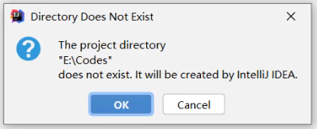
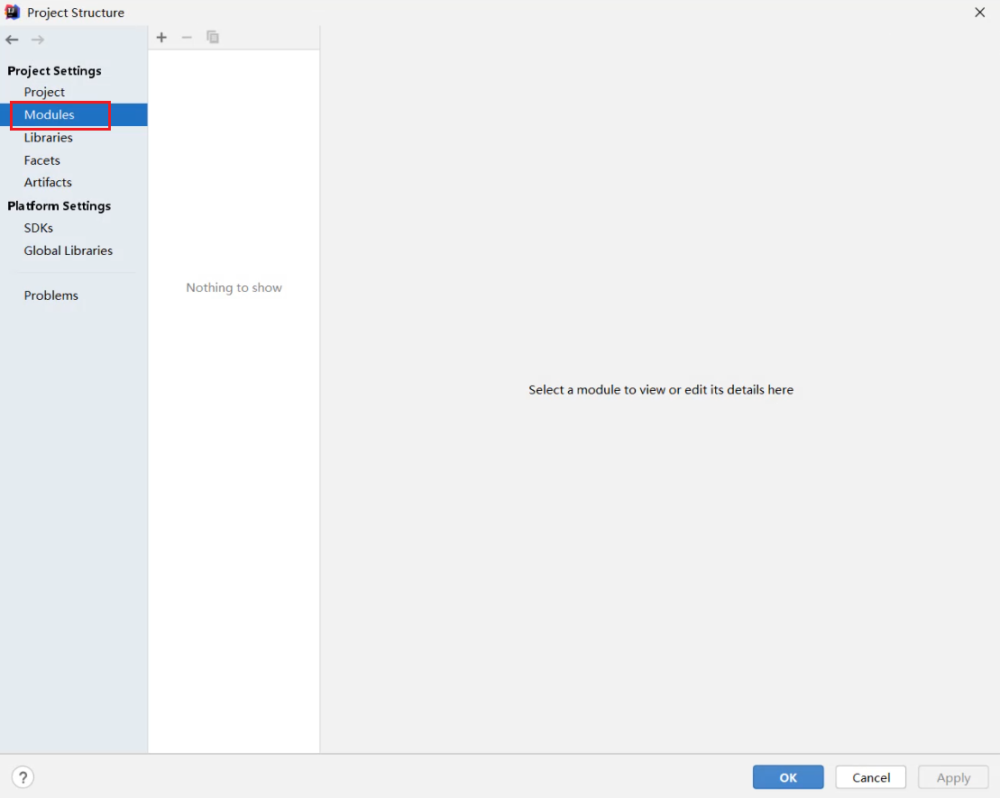
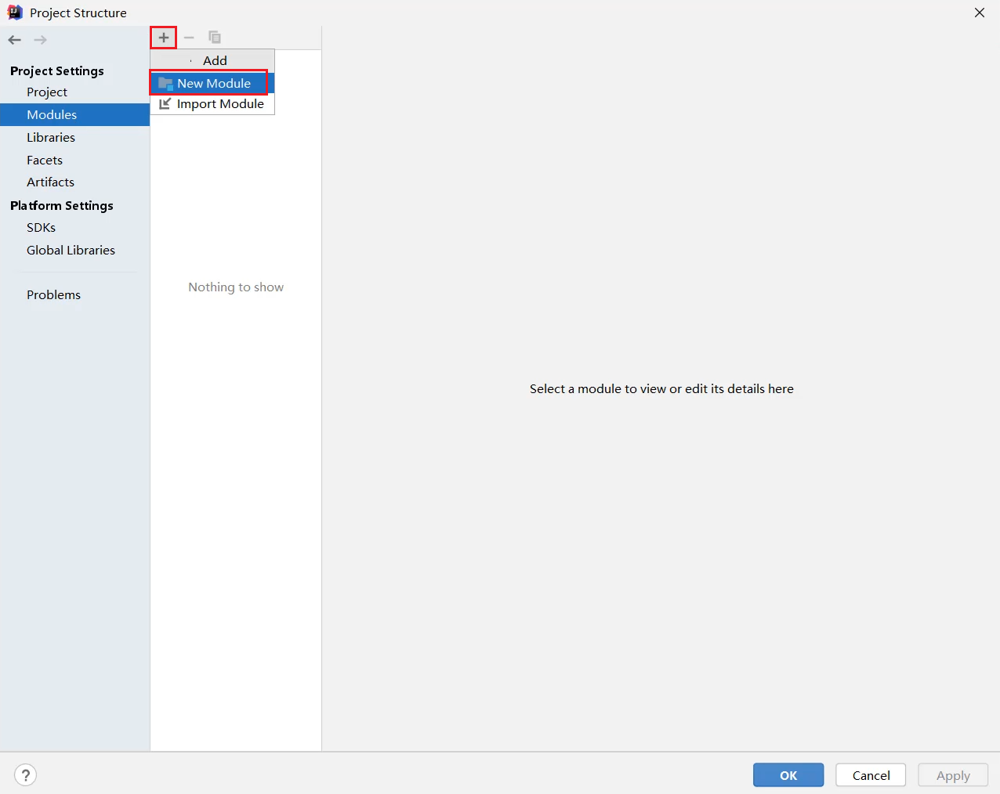
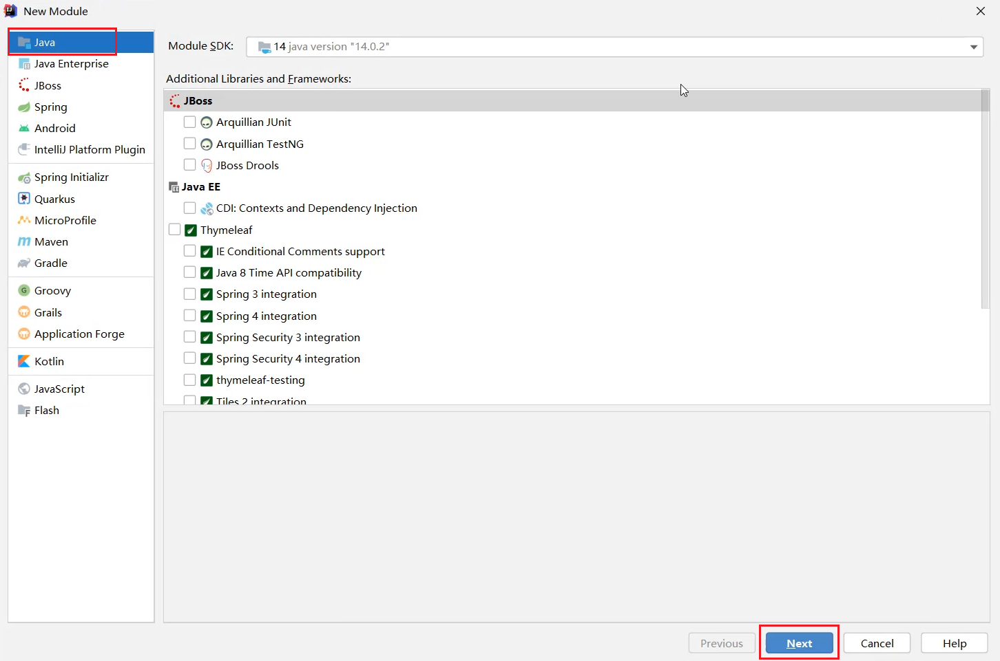

# day02 - Java基础语法

## 1. 注释

​	注释是对代码的解释和说明文字。

Java中的注释分为三种：

* 单行注释：

~~~java
// 这是单行注释文字
~~~

* 多行注释：

~~~java
/*
这是多行注释文字
这是多行注释文字
这是多行注释文字
*/
注意：多行注释不能嵌套使用。
~~~

* 文档注释（暂时用不到）：

```java
/**
这是多行注释文字
这是多行注释文字
这是多行注释文字
*/
```

### 使用的技巧

​	如果我们要对代码进行解释，那么就可以使用注释。

​	当注释的内容比较少，一行就写完了，可以用单行注释。

​	如果注释的内容比较多，需要写在多行，那么可以使用多行注释。

### 注意点

​	注释的内容不会参与编译和运行的，仅仅是对代码的解释说明而已。

​	所以，不管在注释当中写什么内容，都不会影响代码运行的结果。

## 2. 关键字

### 2.1 概念

​	被Java赋予了特定含义的英文单词。

​	当我们在代码中写了关键字之后，程序在运行的时候，就知道要做什么事情了。

注意：关键字很多，不用刻意去记。

| **abstract**   | **assert**       | **boolean**   | **break**      | **byte**   |
| -------------- | ---------------- | ------------- | -------------- | ---------- |
| **case**       | **catch**        | **char**      | **class**      | **const**  |
| **continue**   | **default**      | **do**        | **double**     | **else**   |
| **enum**       | **extends**      | **final**     | **finally**    | **float**  |
| **for**        | **goto**         | **if**        | **implements** | **import** |
| **instanceof** | **int**          | **interface** | **long**       | **native** |
| **new**        | **package**      | **private**   | **protected**  | **public** |
| **return**     | **strictfp**     | **short**     | **static**     | **super**  |
| **switch**     | **synchronized** | **this**      | **throw**      | **throws** |
| **transient**  | **try**          | **void**      | **volatile**   | **while**  |

### 2.2 第一个关键字class

​	表示定义一个类。创建一个类。

类：Java项目最基本的组成单元，一个完整的Java项目有可能会有成千上万个类来组成的。

class后面跟随的就是这个类的名字，简称：类名。

在类名后面会有一对大括号，表示这个类的内容。

举例：

```java
public class HelloWorld{
    
   
}
```

解释：class表示定义类。

​	类名：HelloWorld

​	HelloWorld后面的大括号表示这个类的范围。

## 3. 字面量

作用：告诉程序员，数据在程序中的书写格式。

| **字面量类型** | **说明**                                  | **程序中的写法**           |
| -------------- | ----------------------------------------- | -------------------------- |
| 整数           | 不带小数的数字                            | 666，-88                   |
| 小数           | 带小数的数字                              | 13.14，-5.21               |
| 字符           | 必须使用单引号，有且仅能一个字符          | ‘A’，‘0’，   ‘我’          |
| 字符串         | 必须使用双引号，内容可有可无              | “HelloWorld”，“黑马程序员” |
| 布尔值         | 布尔值，表示真假，只有两个值：true，false | true 、false               |
| 空值           | 一个特殊的值，空值                        | 值是：null                 |

~~~java
public class Demo {
    public static void main(String[] args) {
        System.out.println(10); // 输出一个整数
        System.out.println(5.5); // 输出一个小数
        System.out.println('a'); // 输出一个字符
        System.out.println(true); // 输出boolean值true
        System.out.println("欢迎来到黑马程序员"); // 输出字符串
    }
}
~~~

### 区分技巧

1. 不带小数点的数字都是整数类型的字面量。
2. 只要带了小数点，那么就是小数类型的字面量。
3. 只要用双引号引起来的，不管里面的内容是什么，不管里面有没有内容，都是字符串类型的字面量。
4. 字符类型的字面量必须用单引号引起来，不管内容是什么，但是个数有且只能有一个。
5. 字符类型的字面量只有两个值，true、false。
6. 空类型的字面量只有一个值，null。

## 4. 变量

### 4.1 什么是变量？

​	变量就在程序中临时存储数据的容器。但是这个容器中只能存一个值。

### 4.2 变量的定义格式

​	数据类型 变量名 = 数据值；

#### 4.2.1 格式详解

​	数据类型：限定了变量当中能存储什么类型的数据。

​			   如果要存10，那么数据类型就需要写整数类型。

​			   如果要存10.0，那么数据类型就需要写小数类型。

​	变量名：其实就是这个容器的名字。

​			当以后想要使用变量里面的数据时，直接使用变量名就可以了。

​	数据值：真正存储在容器中的数据。

​	分号：表示语句的结束，就跟以前写作文时候的句号是一样的。

#### 4.2.2 常用的数据类型

​	整数：int

​	小数：（浮点数）double

​	其他数据类型稍后讲解

举例：

```java
public class VariableDemo{
	public static void main(String[] args){
		//定义一个整数类型的变量
		//数据类型 变量名 = 数据值;
		int a = 16;
		System.out.println(a);//16
		
		//定义一个小数类型的变量
		double b = 10.1;
		System.out.println(b);//10.1
	}
}
```

#### 4.2.3 变量的注意事项

- 变量名不能重复
- 在一条语句中，可以定义多个变量。但是这种方式影响代码的阅读，所以了解一下即可。
- 变量在使用之前必须要赋值。

案例：

```java
public class VariableDemo2{
	public static void main(String[] args){
		//1.变量名不允许重复
		//int a = 10;
		//int a = 20;
		//System.out.println(a);
		
		//2.一条语句可以定义多个变量
		//了解。
		//int a = 10, b = 20, c = 20,d = 20;
		//System.out.println(a);//?
		//System.out.println(b);//?
		
		
		//3.变量在使用之前必须要赋值
		int a = 30;
		System.out.println(a);
	}
}
```

### 4.3 变量的练习

​	需求：说出公交车到终点站之后，车上一共有多少乘客？

​		    一开始没有乘客。

​		   第一站：上去一位乘客，没有下来乘客。

​		   第二站：上去两位乘客，下来一位乘客。

​		   第三站：上去两位乘客，下来一位乘客。

​		   第四站：没有上去乘客，下来一位乘客。

​		   第五站：上去一位乘客，没有下来乘客。

​		   问：到了终点站之后，车上一共多少乘客？

​	代码解析：

```java
public class VariableTest1{
	//主入口
	public static void main(String[] args){
		//一开始没有乘客。
		int count = 0;
		//第一站：上去一位乘客
		//在原有的基础上 + 1
		count = count + 1;
		//System.out.println(count);
		//第二站：上去两位乘客，下来一位乘客
		count = count + 2 - 1; 
		//第三站：上去两位乘客，下来一位乘客
		count = count + 2 - 1;
		//第四站：下来一位乘客
		count = count - 1;
		//第五站：上去一位乘客
		count = count + 1;
		//请问：到了终点站，车上一共几位乘客。
		System.out.println(count);//3
	}
}
```

## 5. 数据类型

### 5.1 Java语言数据类型的分类

- 基本数据类型
- 引用数据类型（面向对象的时候再深入学习）

### 5.2 基本数据类型的四类八种

| 数据类型 | 关键字  | 内存占用 |                 取值范围                  |
| :------: | :-----: | :------: | :---------------------------------------: |
|   整数   |  byte   |    1     |    负的2的7次方 ~ 2的7次方-1(-128~127)    |
|          |  short  |    2     | 负的2的15次方 ~ 2的15次方-1(-32768~32767) |
|          |   int   |    4     |        负的2的31次方 ~ 2的31次方-1        |
|          |  long   |    8     |        负的2的63次方 ~ 2的63次方-1        |
|  浮点数  |  float  |    4     |        1.401298e-45 ~ 3.402823e+38        |
|          | double  |    8     |      4.9000000e-324 ~ 1.797693e+308       |
|   字符   |  char   |    2     |                  0-65535                  |
|   布尔   | boolean |    1     |                true，false                |

#### 说明

​	e+38表示是乘以10的38次方，同样，e-45表示乘以10的负45次方。

​	在java中整数默认是int类型，浮点数默认是double类型。

#### 需要记忆以下几点

byte类型的取值范围：

​	-128 ~ 127

int类型的大概取值范围：

​	-21亿多  ~ 21亿多

整数类型和小数类型的取值范围大小关系：

​	double > float > long > int > short > byte

最为常用的数据类型选择：

- 在定义变量的时候，要根据实际的情况来选择不同类型的变量。

  比如：人的年龄，可以选择byte类型。

  比如：地球的年龄，可以选择long类型。

- 如果整数类型中，不太确定范围，那么默认使用int类型。

- 如果小数类型中，不太确定范围，那么默认使用double类型。

- 如果要定义字符类型的变量，那么使用char

- 如果要定义布尔类型的变量，那么使用boolean

### 5.3 定义8种基本数据类型变量

```java
public class VariableDemo3{
    public static void main(String[] args){
        //1.定义byte类型的变量
        //数据类型 变量名 = 数据值;
        byte a = 10;
        System.out.println(a);

        //2.定义short类型的变量
        short b = 20;
        System.out.println(b);

        //3.定义int类型的变量
        int c = 30;
        System.out.println(c);

        //4.定义long类型的变量
        long d = 123456789123456789L;
        System.out.println(d);

        //5.定义float类型的变量
        float e = 10.1F;
        System.out.println(e);

        //6.定义double类型的变量
        double f = 20.3;
        System.out.println(f);

        //7.定义char类型的变量
        char g = 'a';
        System.out.println(g);

        //8.定义boolean类型的变量
        boolean h = true;
        System.out.println(h);

    }
}
```

#### **注意点**

- 如果要定义 一个整数类型的变量，不知道选择哪种数据类型了，默认使用int。
- 如果要定义 一个小数类型的变量，不知道选择哪种数据类型了，默认使用double。
- 如果要定义一个long类型的变量，那么在数据值的后面需要加上L后缀。（大小写都可以，建议大写。）
- 如果要定义一个float类型的变量，那么在数据值的后面需要加上F后缀。（大小写都可以）

### 5.4 练习1

需求：定义5个变量记录老师的信息并打印

代码示例：

```java
public class VariableTest1{
	public static void main(String[] args){
		//1.定义字符串类型的变量记录老师的姓名
		String name = "黑马谢广坤";
		//2.定义整数类型的变量记录老师的年龄
		int age = 18;
		//3.定义字符类型的变量记录老师的性别
		char gender = '男';
		//4.定义小数类型的变量记录老师的身高
		double height = 180.1;
		//5.定义布尔类型的变量记录老师的婚姻状况
		boolean flag = true;
		
		//输出5个变量的值
		System.out.println(name);
		System.out.println(age);
		System.out.println(gender);
		System.out.println(height);
		System.out.println(flag);
		
	}
}
```

### 5.5 练习2

需求：将（电影名称，主演，年份，评分）四个信息选择不同类型的变量，随后打印出来。

 代码示例：

```java
public class VariableTest2{
	public static void main(String[] args){
		//1.定义字符串变量记录电影的名称
		String movie = "送初恋回家";
		//2.定义三个变量记录主演的名字
		String name1 = "刘鑫";
		String name2 = "张雨提";
		String name3 = "高媛";
		//3. 定义整数类型的变量记录年龄的年份
		int year = 2020;
		//4.定义小数类型的变量记录电影的评分
		double score = 9.0;
		
		//打印变量的信息
		System.out.println(movie);
		System.out.println(name1);
		System.out.println(name2);
		System.out.println(name3);
		System.out.println(year);
		System.out.println(score);
		
	}
}
```

### 5.6 练习3

需求：选择其中一部手机，将（手机价格，手机品牌）两个信息选择不同类型的变量，随后打印出来。 

 代码示例：

```java
public class VariableTest3{
	public static void main(String[] args){
		//1.定义小数类型的变量记录手机的价格
		double price = 5299.0;
		
		//2.定义字符串类型的变量记录手机的品牌
		String brand = "华为";
		
		//输出变量记录的值
		System.out.println(price);
		System.out.println(brand);
	}
}
```

## 6. 标识符

业内大多数程序员都在遵守阿里巴巴的命名规则。

在day02的资料文件夹中有。

### 6.1 硬性要求：

​	必须要这么做，否则代码会报错。

- 必须由数字、字母、下划线_、美元符号$组成。
- 数字不能开头
- 不能是关键字
- 区分大小写的。

### 6.2 软件建议：

​	如果不这么做，代码不会报错，但是会让代码显得比较low。

### 6.2.1 小驼峰命名法

适用于变量名和方法名

* 如果是一个单词，那么全部小写，比如：name

* 如果是多个单词，那么从第二个单词开始，首字母大写，比如：firstName、maxAge

### 6.2.2 大驼峰命名法

适用于类名

* 如果是一个单词，那么首字母大写。比如：Demo、Test。

* 如果是多个单词，那么每一个单词首字母都需要大写。比如：HelloWorld

不管起什么名字，都要做到见名知意。

### 阿里巴巴命名规范细节：

1. 尽量不要用拼音。但是一些国际通用的拼音可视为英文单词。

   正确：alibaba、hangzhou、nanjing

   错误：jiage、dazhe

2. 平时在给变量名、方法名、类名起名字的时候，不要使用下划线或美元符号。

   错误：_name

   正确：name

## 7. 键盘录入

​	键盘录入的实际功能Java已经帮我们写好了，不需要我们自己再实现了，而Java写好的功能都放在了Scanner这个类中，所以，我们只要直接使用Scanner这个类就可以了。

使用步骤：

第一步：

​	导包：其实就是表示先找到Scanner这个类在哪。

第二步：

​	创建对象：其实就表示申明一下，我准备开始用Scanner这个类了。

第三步：

​	接收数据：也是真正干活的代码。

代码示例：

```java
//导包，其实就是先找到Scanner这个类在哪
import java.util.Scanner;
public class ScannerDemo1{
	public static void main(String[] args){
		//2.创建对象，其实就是申明一下，我准备开始用Scanner这个类了。
		Scanner sc = new Scanner(System.in);
		//3.接收数据
		//当程序运行之后，我们在键盘输入的数据就会被变量i给接收了
		System.out.println("请输入一个数字");
		int i = sc.nextInt();
		System.out.println(i);
	}
}
```

## 8. IDEA

### 8.1 IDEA概述

​	IDEA全称IntelliJ IDEA，是用于Java语言开发的集成环境，它是业界公认的目前用于Java程序开发最好的工具。

**集成环境：**

​	把代码编写，编译，执行，调试等多种功能综合到一起的开发工具。

### 8.2 IDEA的下载和安装

#### 8.2.1 下载

​	可以到官方网站自行下载，网址为：https://www.jetbrains.com/idea

​	今天的资料中，对应的安装包也提高给大家了。

#### 8.2.2 安装

- 到资料文件夹中，双击安装包。
- 点击next，准备安装


- 点击Browse修改安装路径。

  修改完毕点击next


- 勾选64-bit launcher。表示在桌面新建一个64位的快捷方式。

  其他的不要勾选。

  点击next。


- 点击Install，准备安装。


- 等进度条读取完毕之后，会有最终界面提示。

  点击finish即可。


- 第一次启动会询问，是否导入一些设置。

  选择第二个不导入，保持默认设置，再点击OK。


- 选择背景主题

  左边是黑色背景。右边是白色背景。

  这个可以根据自己的喜好来选择。

  选择完毕点击右下角的next


- 在本界面让我们购买idea。

  因为我们是学习阶段，所以可以使用免费使用30天。

  点击第一排第二个。Evaluate for free


- 点击蓝色的Evaluate，就可以开始免费试用30天了。


- 当看到这个界面，就表示idea已经成功安装完毕

  可以点击右上角关闭。


### 8.3 IDEA中层级结构介绍

#### 8.3.1 结构分类

- project（项目、工程）
- module（模块）
- package（包）
- class（类）

#### 8.3.2 结构介绍

​	为了让大家更好的吸收，package这一层级，我们后面再学习，先学习最基础的project、module、class。

##### project（项目、工程）

​	淘宝、京东、黑马程序员网站都属于一个个项目，IDEA中就是一个个的Project。

##### module（模块）

​	在一个项目中，可以存放多个模块，不同的模块可以存放项目中不同的业务功能代码。在黑马程序员的官方网站中，至少包含了以下模块：

- 论坛模块
- 报名、咨询模块

为了更好的管理代码，我们会把代码分别放在两个模块中存放。

##### package（包）

​	一个模块中又有很多的业务，以黑马程序员官方网站的论坛模块为例，至少包含了以下不同的业务。

- 发帖
- 评论

为了把这些业务区分的更加清楚，就会用包来管理这些不同的业务。

##### class（类）

​	就是真正写代码的地方。

#### 8.3.3 小结

- 层级关系

  ​	project - module - package - class

- 包含数量

  ​	project中可以创建多个module
  ​	module中可以创建多个package
  ​	package中可以创建多个class

  ​	这些结构的划分，是为了方便管理类文件的。

### 8.4 IDEA中的第一个代码

##### 8.4.1 操作步骤

- 创建Project 项目
- 创建Module 模块
- 创建class   类
- 在类中编写代码
- 完成编译运行

##### 8.4.2 分步图解

- 双击启动图标

  

- 首先要新建一个项目

  点击creat new project

  

- 我们要从0开始写代码，所以新建一个空的什么都没有的项目。

  点击左下方的Empty Project

  再点击右下角的next


- 输入项目的名称

  输入项目的存放路径


- 点击ok。idea会帮助我们在本地创建一个项目文件夹



- 点击Module，准备新建一个模块



- 点击+

  再点击New Module



- 我们要编写Java代码，所以要新建一个Java模块。

  点击Java

  再点击右下角的next



- 输入模块的名称

  再点击右下角的Next


- 成功新建一个模块之后，中间就会出现刚刚新建的模块

  点击右下角的OK


- 回到主界面

  展开刚刚新建的模块

  右键点击src，选择New，选择Java Class


- 输入类名

  再按回车


- 由于字体比较小

  所以，我们要设置一下字体。

  点击File，选择Setting。


- 搜索一下font

  在右边可以输入Size的数值来调节代码字体的大小。

  设置完毕后点击右下角的OK


- 编写代码


- 运行代码

  右键空白处，点击Run


- 最下面会弹出控制台。

  所有输出语句中的内容，都会在控制台上展示。


### 8.5 IDEA中类的相关操作

#### 8.5.1 类的相关操作

- 新建类文件
- 删除类文件
- 修改类文件

#### 8.5.2 新建类文件

- 所有的Java代码都会写在src文件夹当中。

  所以，右键点击src，选择new，点击Java Class

  

- 输入类名，再按回车

  

- 新建完毕


#### 8.5.3 修改类名

- 右键点击想要修改的文件

  点击Refactor

  再点击Rename


- 输入想要修改的名字

  输入完毕点击下面的Refactor


- 文件名和类名均已修改成功

  

#### 8.5.4 删除类文件

- 想要删除哪个文件，就右键点击该文件

  选择Delete即可


- 在弹出的界面中点击OK，确定删除


> 小贴士：
>
> 此时删除是不走回收站的，直接从硬盘中删掉了。

### 8.6 IDEA中模块的相关操作

#### 8.6.1 模块的相关操作

- 新建模块
- 删除模块
- 修改模块
- 导入模块

#### 8.6.2 新建模块

- 点击File，选择Project Structure


- 选择Module


- 点击+

  选择New Module


- 要创建一个Java模块，所以选择第一个Java

  点击右下角的Next


- 输入模块的名称

  点击右下角的Finish


- 成功新建完毕之后，在中间空白区域就出现了刚刚新建的模块

  点击右下角的OK


- 在主界面中，也会出现刚刚新建的模块


#### 8.6.3 删除模块

- 右键点击模块

  选择Remove Module


- 选择Remove，表示确定删除


- 此时发现，在IDEA列表页面，删除的模块已经不在了。


> 小贴士：
>
> 此时删除仅仅是从IDEA列表中的删除，在本地硬盘中还是存在的。

#### 8.6.4 修改模块

- 右键点击模块名

  选择Refactor

  再选择Rename


- 选择第三个修改模块名和本地文件夹名

  点击OK


- 输入要修改的新的模块名

  输入完毕点击Refactor


- 回到主界面，就发现模块名和文件夹名都已经修改完毕


#### 8.6.5 导入模块

- 点击File，选择Project Structure


- 选择Module

  点击+

  选择Import Module


- 从本地硬盘中选择要导入的模块

  再点击OK


- 不断点击Next


- 如果中间出现提示框，则点击Overwrite

  然后继续点击右下角的Next


- 一直点到finish为止


- 成功导入后，在中间位置就会出现导入的模块信息


- 在主界面中也会出现导入的模块信息


- 展开模块点击模块中的Java文件，会发现代码报错。

  是因为导入模块跟JDK没有关联导致。


- 可以点击右上角的Setup SDK

  再选择已经安装的JDK版本即可


- 导入完毕之后，代码就恢复正常不会报错了


### 8.7 IDEA中项目的相关操作

#### 8.7.1 项目的相关操作

- 关闭项目
- 打开项目
- 修改项目
- 新建项目

#### 8.7.2 关闭项目

- 点击File，选择Close Project即可


- 刚刚操作的项目就已经关闭了

  左侧是项目列表，如果要再次打开该项目，直接点击即可。

  右侧有create new project，可以再建一个新的项目


- 鼠标放在项目上，后面会出现一个叉。

  如果点击了这里的叉，会在IDEA的列表中删除。不会删除本地硬盘上的项目。


#### 8.7.3 打开项目

- 在本界面还可以打开本地已经存在的项目

  点击Open or Import


- 选择要打开的项目

  点击OK


- 项目就被打开了。


#### 8.7.4 修改项目

- 点击File，选择Project Structure


- 在这个界面，默认是Module

  所以，要先点击Project

  在右侧页面中，输入新的项目名称

  修改JDK版本和编译版本都变成JDK14

  再点击OK


- 此时发现，项目名称已经修改完毕


- 但是本地文件夹的名字还没有修改


- 需要先关闭当前项目


- 点击项目后面的叉，从列表中移除项目


- 到本地硬盘中手动修改文件夹的名称

 

- 点击Open or Import重新打开项目


- 选择修改之后的项目

  点击OK


- 此时会发现，项目名称和本地硬盘文件夹的名称都已经修改完毕了


#### 8.7.5 新建项目

- 点击File

  选择New

  点击Project


- 同样还是创建一个什么都没有的空项目


- 输入项目的名称

  点击右下角的finish


- IDEA循环是否需要帮我们在本地创建一个新的文件夹

  点击OK


- 询问是在本窗口打开还是在一个新的窗口打开。

  可以点击New Window，在一个新的窗口打开。


- 此时就出现了两个窗口，在一个新的窗口打开了新的项目


